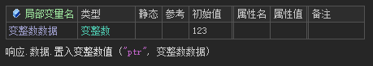
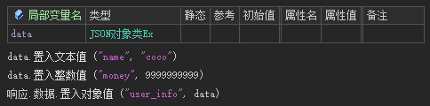
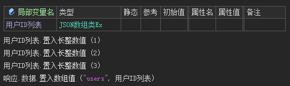
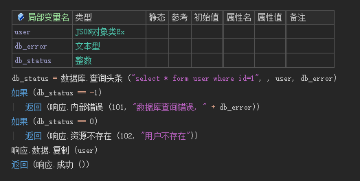
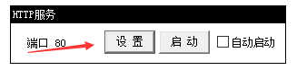
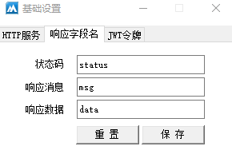

# 响应

## 1. 设置响应数据

### 1.1 调用方法

响应数据可调用 `响应.数据.置入xxx()`

| 响应数据类型 | 调用方法                                                     |
| ------------ | ------------------------------------------------------------ |
| 文本         | 响应.数据.置入文本值 ("name", "coco")                        |
| 小数         | 响应.数据.置入小数值 ("float", 3.14)                         |
| 整数         | 响应.数据.置入整数值 ("age", 18)                             |
| 长整数       | 响应.数据.置入长整数值 ("long", 9999999999)                  |
| 逻辑型       | 响应.数据.置入逻辑值 ("bool", 真)                            |
| 变整数       |  |
| JSON对象     |  |
| JSON数组     |  |

## 1.2 小技巧

假设从数据库查询了一个用户数据，想要直接作为响应给前端，不需要写一遍置入，可以直接使用 `响应.数据.复制`，举例说明：



---

## 2. 设置响应Header

```
响应.添加响应头 ("key", "value")
```

---

## 3. 设置响应Cookie

```
响应.添加Cookie ()
响应.添加Cookie2 ()
```

---

## 4. 发送响应

> 响应的发送方法，调用后前端才能收到响应数据

### 4.1 普通用法

| 方法          | HTTP状态码 | 描述                   |
| ------------- | ---------- | ---------------------- |
| **响应.成功** | **200**    | **服务器处理请求成功** |
| 响应.失败     | 200        | 服务器处理请求失败     |

> 所有的响应的HTTP状态码都是200，前端根据响应数据里的status判断请求是否成功

### 4.2 使用RESTful规范

明确了失败情况，只要请求失败，HTTP状态码必然不是200

| 方法                  | HTTP状态码 | 描述                                                         |
| --------------------- | ---------- | ------------------------------------------------------------ |
| **响应.成功**         | **200**    | **服务器处理请求成功**                                       |
| 响应.创建成功         | 200201     | 用户创建账号、添加新增数据等成功                             |
| 响应.重定向_永久      | 301        | 请求路径已经有了新的版本，返回新版本请求路径，前端应该尽快修改接口，防止旧接口失效 |
| 响应.重定向_临时      | 302        | 请求的路径暂时失效，返回临时请求路径                         |
| 响应.参数错误         | 400        | 参数检查失败、参数不合法、缺少参数                           |
| 响应.未授权           | 401        | 未登录、没有传递认证信息                                     |
| 响应.拒绝访问         | 403        | 身份认证失效、没有传递认证信息                               |
| 响应.资源不存在       | 404        | 资源不存在或未找到。查找的用户、数据不存在                   |
| 响应.资源已存在       | 409        | 创建账号或数据时，已经有一个一模一样的数据                   |
| 响应.请求体太大       | 413        | 前端提交的数据大于服务器设置的最大请求数据大小               |
| 响应.不支持的媒体类型 | 415        | 不支持请求中所指定的媒体类型，比如上传文件时只允许上传jpg图片 |
| 响应.请求频繁         | 429        | 请求过于频繁                                                 |
| 响应.内部错误         | 500        | 业务逻辑错误，比如配置错误，数据库操作报错等                 |
| 响应.尚未实现         | 501        | 等待实现的接口                                               |

---

## 5. 响应数据结构

### 5.1 响应数据结构

响应JSON数据，默认格式如下

```
{
	'status': 0, // 响应状态
	'msg': 'success', // 描述文本
	'data': {...} // 响应数据
}
```

### 5.2 自定义响应字段名

- 运行服务器

- 在没有启动服务的情况下，点击设置按钮

  

- 选择响应字段名标签页，修改设置后保存即可

  

  
