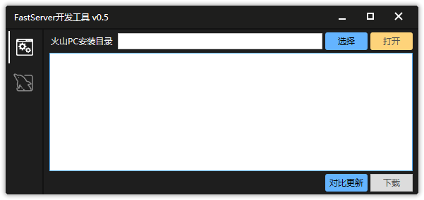
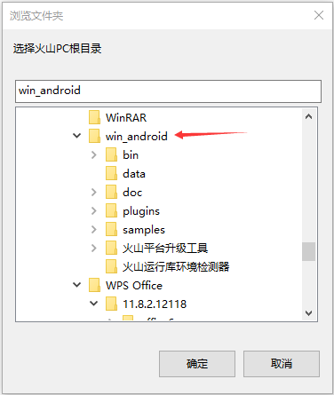
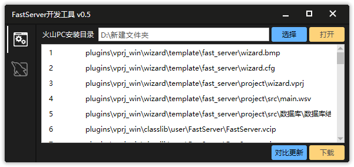

1. 下载 <a href="https://wway.lanzoub.com/iRfTZ131jpid" download target="_blank">开发工具</a>

2. 解压后**运行exe**

   

3. 点击选择按钮，选择火山PC的安装的根目录（目录名可能是别的）

   

   > 如果提示："请重新选择火山PC目录"，必然是目录选择错误。程序会检测所选目录下是否包含 `\plugins\vprj_android` 和 `\plugins\vprj_win` 两个目录

4. 点对比更新，会对比文件md5，软件会显示都有哪些文件需要下载

   

5. 点击下载。以下为目录对应关系（依赖关系为 `创建项目用的模板` **依赖** `模版模块`，`模版模块` **依赖** `框架模块`）

   > **框架模块：**\plugins\vprj_win\classlib\user\\`FastServer模块`

   > **模版模块：**\plugins\vprj_win\classlib\user\\`FastServer模块_模版`

   > **创建项目用的模板：**\plugins\vprj_win\wizard\template\\`FastServer项目模版`

6. 重新打开火山PC即可

