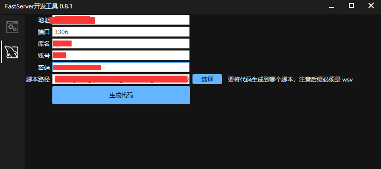
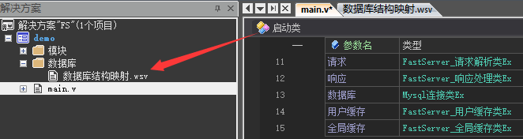
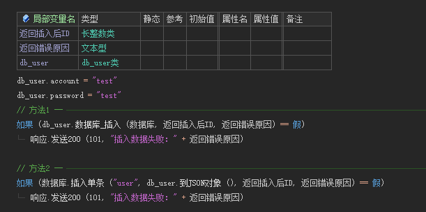
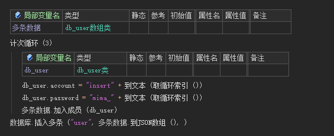
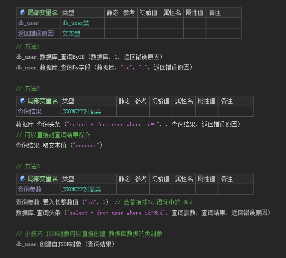
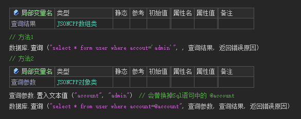
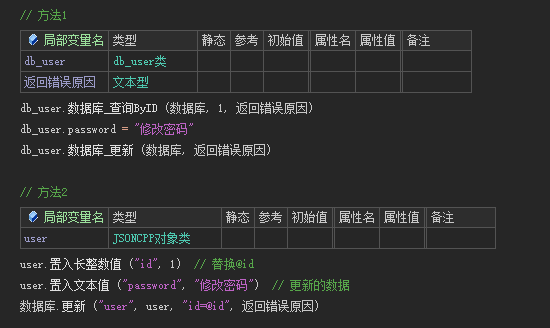
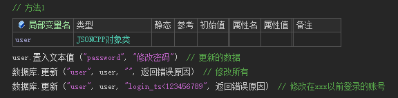
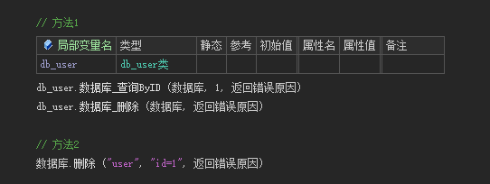

# 数据库

## 1. 原生用法

> 通过上面的写法可以实现任何功能，但需要提前处理校验好参数，谨防sql注入

---

## 2. 进阶用法

### 2.1 生成数据库映射

- 打开 **开发工具**， 选择数据库切页

  

- 输入数据库连接信息

- 点击选择按钮，选择FastServer项目里的数据库结构映射文件所在路径

  

- 点击生成代码

!> 修改数据库结构、添加表都需要重新生成代码

### 2.2 插入单条

### 2.3 插入多条

### 2.4 查询单条数据

### 2.5 查询多条数据

### 2.6 修改单条数据

### 2.7 修改多条数据

### 2.8 删除单条数据

### 2.9 删除多条数据

!> 只要是通过 `@参数` 这种方式传入的参数，可以防注入

!> 暂时只支持Mysql，因为Mysql完全够用，说Mysql慢的是自己数据库优化没做好