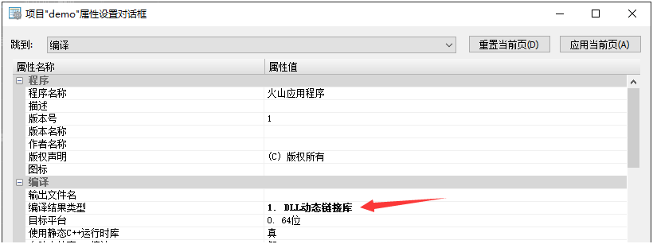
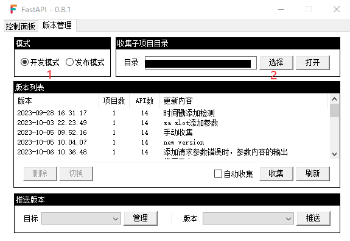
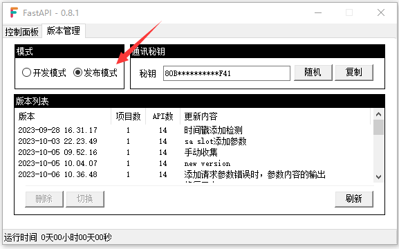

# 热更

## 1. 本地开发环境准备

- 下载最新版本的 [主程序](https://wway.lanzoub.com/s/fsmain)

- 新建一个文件夹，比如 `D://赚他一个亿` ，然后将主程序丢到文件夹内

- 修改 `主程序.exe` 的文件名，建议和项目名一致，比如 `赚他一个亿.exe`

- 修改现有子项目的编译结果类型为动态链接库

  

- 运行 `赚他一个亿.exe`，选择版本管理

- 设置模式为 `开发模式`，并设置子项目的收集目录

  

  !> _int的父目录

## 2. 收集版本

收集有两种方式

- **自动收集：**子项目编译的时候会自动收集版本。缺点是子项目编译结束后，大约要10秒左右才会收集结束
- **手动收集：**点击收集按钮就会收集

## 3. 部署正式服

- 在目标服务器上新建项目文件夹，将主程序上传到该目录并改名 `赚他一个亿.exe`

- 运行 `赚他一个亿.exe`

- 选择版本管理标签页，设置模式为 `发布模式`

  

## 4. 添加远程服务器

- 本地 **开发环境** 中，选择版本管理

- 点击推送版本区域中的管理按钮

  

- 点击添加，在弹出的窗口中补全信息。通讯秘钥需要在 **正式服** 的服务上，点击复制得到

  

## 5. 推送版本

- 选择要推送的远程服务器
- 选择要推送的版本
- 点击推送按钮
- 完善要版本信息，用于服务器明确版本内容，在有必要的时候切换版本

