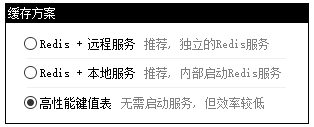

## 1. 缓存类型

- **全局缓存**
- **用户缓存：**用户缓存基于JWT，如果前端不维护JWT，则无法使用。浏览器可以直接保存在cookie中

### 2. 取缓存

| 方法         |
| ------------ |
| 取整数值     |
| 取短整数值   |
| 取长整数值   |
| 取小数值     |
| 取字节集     |
| 取文本值     |
| 取变整数值   |
| 取逻辑值     |
| 取JSON对象值 |
| 取JSON数组值 |

## 3. 设置缓存

| 方法           |
| -------------- |
| 置入整数值     |
| 置入短整数值   |
| 置入长整数值   |
| 置入小数值     |
| 置入字节集     |
| 置入文本值     |
| 置入变整数值   |
| 置入逻辑值     |
| 置入JSON对象值 |
| 置入JSON数组值 |

## 4. 缓存方案

