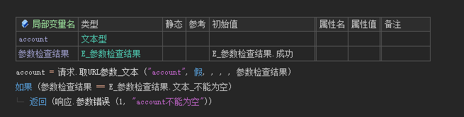
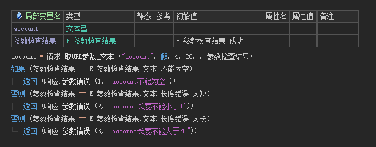
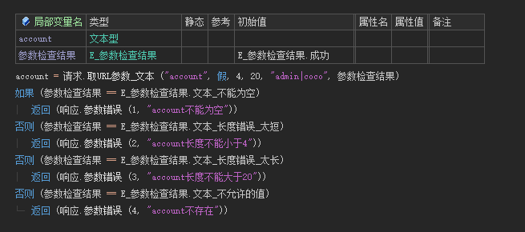
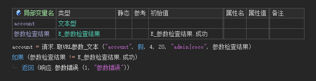

# 请求

## 1. 取请求参数

### 1.1 GET请求

GET请求获取参数的方法有两种，`请求.取URL参数_xxx` 和 `请求.取参数_xxx`

| 请求                                                      | 使用方法                              | 结果                     |
| --------------------------------------------------------- | ------------------------------------- | ------------------------ |
| /demo?name=coco                                           | 请求.取URL参数\_**文本** ("name")     | "coco"                   |
| /demo?size=1.33                                           | 请求.取URL参数\_**小数** ("size")     | 1.33                     |
| /demo?page=3                                              | 请求.取URL参数\_**整数** ("page")     | 3                        |
| /demo?id=6666666                                          | 请求.取URL参数\_**长整数** ("id")     | 6666666                  |
| /demo?open=1<br />/demo?open=true<br />/demo?open=真      | 请求.取URL参数_**逻辑值**("open")     | 真                       |
| /demo?info=%7B%22name%22%3A%22coco%22%2C%22age%22%3A99%7D | 请求.取URL参数\_**JSON对象**("info")  | {"name":"coco","age":99} |
| /demo?users=%5B1%2C2%2C3%2C4%5D                           | 请求.取URL参数\_**JSON数组**("users") | [1,2,3,4]                |

!> 推荐使用 **请求.取URL参数_xxx**，因为语义明确，当出现BUG时，可以快速定位到问题


### 1.2 RESTful参数

在使用RESTful规范定义路由时，URL参数可以通过 `请求.取RESTFul参数` 取值，该方法和 `请求.取URL参数_文本` 完全一致。区别在于：

 `请求.取URL参数_文本` ：取请求路径 **?后** 的查询参数

 `请求.取RESTFul参数`：取请求路径 **?前** 的路由参数


### 1.3 非GET请求

取提交数据可以使用 `请求.取参数_xxx` 方法

| 支持方法                          | 结果                     |
| --------------------------------- | ------------------------ |
| 请求.取参数\_**文本** ("name")    | "coco"                   |
| 请求.取参数\_**小数** ("size")    | 1.33                     |
| 请求.取参数\_**整数** ("page")    | 3                        |
| 请求.取参数\_**长整数** ("id")    | 6666666                  |
| 请求.取参数_**逻辑值**("open")    | 真                       |
| 请求.取参数\_**JSON对象**("info") | {"name":"coco","age":99} |
| 请求.取参数_**JSON数组**("users") | [1,2,3,4]                |
| 请求.取参数_**文件**("file")      |                          |

除调用的方法名不同外，用法与 `请求.取URL参数_xxx` 方法**完全一致**

> 在URL查询参数和提交参数有重名时，可通过 `请求.取URL参数_xxx` 取URL参数

!> `请求.取参数_文件` 只在ContentType是 `multipart/form-data` 的情况下才有用 

!> ContentType仅支持 `application/json`、`multipart/form-data`、`application/x-www-form-urlencoded`。在不传ContentType时，默认以json的方式处理

---

## 2. 参数检查

> 以取文本参数为例，其他类型参数、`取参数_xxx` 用法一致

### 2.1 取参数 account, 可空

   ```
   account = 请求.取URL参数_文本 ("account", 真)
   ```

### 2.2 取参数 account, 参数不能为空。不满足需求时，直接返回**具体错误**

   

### 2.3 取参数 account, 参数不能为空，长度大于等于4，小于等于20。不满足需求时，直接返回**具体错误**

   

### 2.4 取参数 account, 参数不能为空，长度大于等于4，小于等于20，允许是 admin 和 coco。不满足需求时，直接返回**具体错误**

   

### 2.5 取参数 account, 参数不能为空，长度大于等于4，小于等于20，允许是 admin 和 coco，在不满足需求时，直接返回**参数错误**

   

---

## 3. 取请求协议头

```
请求.取协议头 ("Content-Type")
```

---

## 4. 取请求Cookie

```
请求.取Cookie ("jwt")
```

