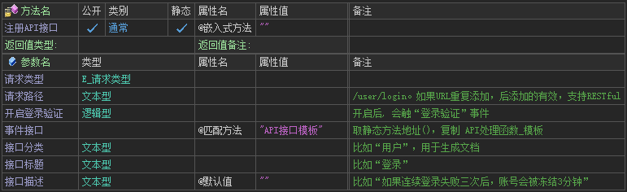
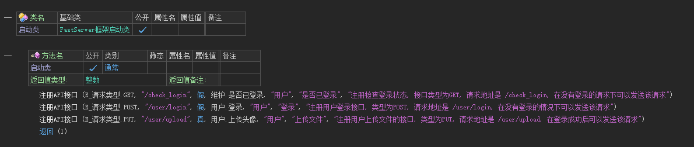

## 一、简介

在服务器框架中，路由注册是指将 URL 路径与处理函数相关联的过程。当客户端请求特定的 URL 时，服务器框架将使用注册的路由来确定应该调用哪个处理程序来处理该请求

## 二、支持的请求类型

| 类型   | FastServer代码    |
| ------ | ----------------- |
| GET    | E_请求类型.GET    |
| POST   | E_请求类型.POST   |
| PUT    | E_请求类型.PUT    |
| PATCH  | E_请求类型.PATCH  |
| DELETE | E_请求类型.DELETE |

## 三、如何注册路由

### 1. 方法名定义

### 2. 注册路由

请在启动类中注册路由

> 路由相同，请求类型相同时，后注册路由有效，先注册的路由失效

> 路由相同，请求类型不同时，两个路由同时生效

