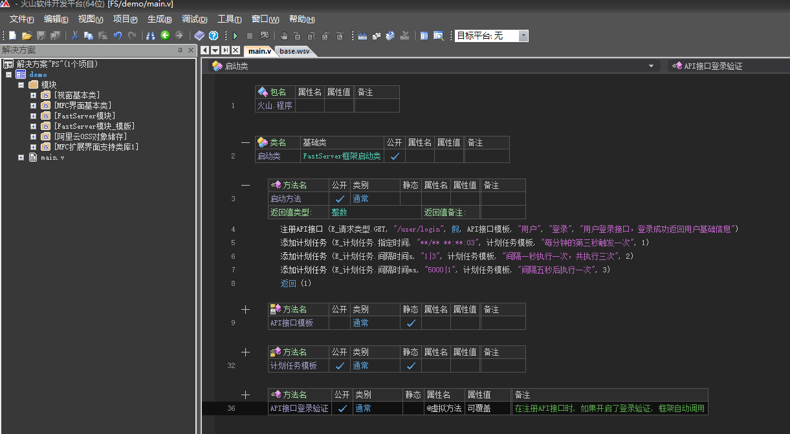
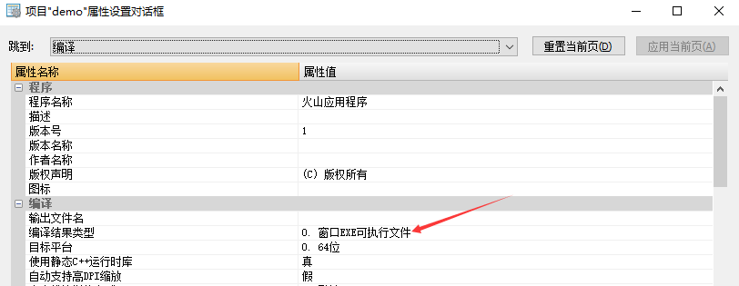
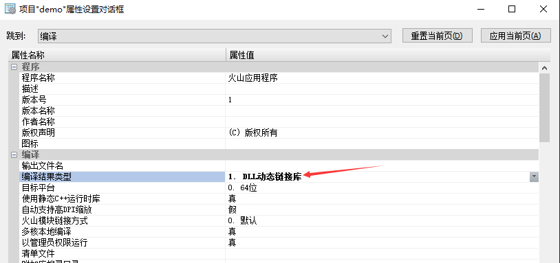

# 项目模板介绍

## 1. 预览

> 代码样式可能会随着版本更新稍微不同，但原理一致

## 2. 模块

- **阿里云OSS对象存储库：**用于数据库数据备份
- **FastServer模块：** 框架基础模块。依赖 `阿里云OSS对象存储库`
- **FastServer模块\_模版：** 服务器模版相关的代码。为了解决更新版本不需要更新项目代码，抽成一个单独的模块。依赖 `FastServer模块`
- **其他模块**：皆为`FastServer模块_模版`所依赖的模块

## 3. 启动方法

该函数用于注`注册API接口`和`添加计划任务`

- **注册API接口：**用于注册路由，当接到用户或前端请求时，应该调用哪个函数进行处理
- **添加计划任务：**用于规避不可控的线程，可实现定时任务、指定时间的任务

!> `注册API接口`必须在`启动方法`内调用

!> 在不明确自己在干什么的情况下，请勿使用线程，需要保证在dll卸载时线程已经执行结束，否则会导致无法热更或关闭服务器后有残留进程。**强烈建议**使用计划任务实现

## 4. 运行

FastServer有两种运行模式

- **单项目模式：**项目配置中编译结果类型为**EXE**。该模式下**不支持热更**，但因为可以调试，建议没有热更需求和开发过程中使用

  

- **多项目模式：**项目配置中编译结果类型为**DLL**。该模式支持热更，但需要配合 `主程序` 使用，可以将多个子项目运行在一个服务器中。在比较复杂的情况下，可以根据业务分成多个子项目，也方便多人开发

  