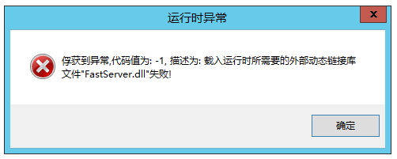

!> 有问题群里问，不接受主动私聊，除非群主主动要求。但后续问题也在群里问，否则不回复

1. 框架是否收费

   ```
   免费
   ```

2. 框架是否有恶意代码和后门

   ```
   可以保证框架内没有任何恶意代码和后门，使用了官方的模块，和本人通过C++实现的功能
   稳定后会考虑添加个数据统计，有多少人在使用框架，使用的是什么版本。但只是想法，暂无计划
   ```

3. 运行报错 **0xE06D7363**

   > 修复系统环境，[下载地址](https://wway.lanzoub.com/isvZu1bgldve)

4. 运行开发工具报错 **0xc000007b**

   > 修复系统环境，[下载地址](https://wway.lanzoub.com/isvZu1bgldve)

5. 前端发送了数据，但是服务器 **取不到参数**

   ```
   请检查content-type是否正确，FS在前端不传递ContentType时，默认以json的方式处理数据
   ```

6. 怎么返回网页

   ```
   可以通过 `响应.发送自定义数据`，来返回网页。但FastServer作为纯后台服务器，不建议这种用法，当然非要这么干，开心就好
   ```

7. 数据库为什么只支持mysql

   ```
   目前只支持Mysql，因为Mysql完全够用，说Mysql慢的是自己数据库优化没做好
   ```

8. 无法收集到子项目

   ```
   检查子项目编译结果是否为动态链接库，框架版本和主程序版本是否一致
   ```

9. 推送版本时卡住不动

   ```
   已知BUG待修复。目前处理方法有两个：
   1. 点击取消按钮
   2. 如果无法取消，关闭本地服务，重新收集版本后推送版本
   ```


10. HTTPS出现 **net::ERR_CERT_AUTHORITY_INVALID** 错误

    > 查看[HTTPS](tutorial/advanced/https.md)相关问题


11. 俘获到异常,代码值为: -1,描述为:载入运行时所需要的外部动态链接库文件"FastServer.dll"失败!

    > 需要修复系统环境，[下载地址](https://wway.lanzoub.com/isvZu1bgldve)

    

12. 项目中有多个FastServer模块

    > 运行清理历史模块，[下载地址](https://wway.lanzoub.com/i7l7W2dx6x5i)

13. 调用接口崩溃、报错

    > 打开服务器配置，关闭精简日志；然后在该接口中逐行添加日志，建议使用`日志.警告`

14. 服务器配置很高，但是FS的服务器没有占满所有CPU

    > 检查程序的线程是否占满，如果占满代表已经达到最大并发。在服务器性能足够的情况下，可以调大最大线程（注意数据库的最大连接数调大一点）

    > 检查是否有外网访问，比如网页访问，如果请求慢，会阻塞当前线程

    > 检查数据库是否为外网连接，如果为外网连接，打印日志检查数据库处理是否慢

    > 检查是否磁盘读写有压力，如果有压力，移除不必要的日志，并在服务器配置中，开启精简日志

15. 服务器崩溃

    > 检查全局变量是否线程安全

    > 检查数组操作是否有越界

16. 服务器是否可以添加黑名单、白名单、请求速率限制等

    > 请通过 防火墙、宝塔、雷池、nginx 实现，不在FS业务范围内

17. 用户缓存.置入文本值和响应.JWT.置入文本值有啥区别

    > jwt的数据会返回给前端，里面可以存id这样的数据，不要放密码等敏感数据，因为jwt可以解析出明文

    > 缓存是根据你配置的缓存方式，存放到不同地方。现在支持redis和键值表两种方式

18. 是否可以使用线程

    > 可以，但不建议，除非你知道自己在做什么。非线程安全的操作会导致崩溃


