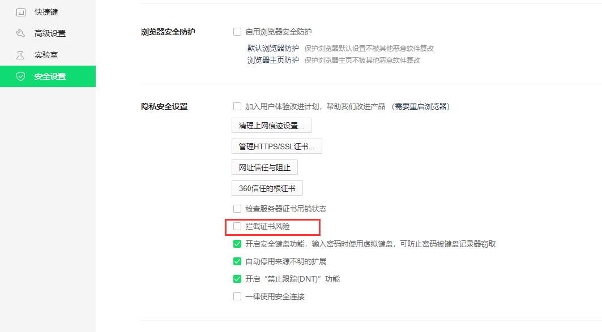

# HTTPS

## 注意问题

1. 开启HTTP必须设置SSL证书

2. SSL证书必须来自受信任的证书颁发机构（如Let's Encrypt、Comodo、Symantec等）签发的有效证书，否则浏览器会出现 **net::ERR_CERT_AUTHORITY_INVALID** 的错误

3. 若无有效证书，可配置浏览器忽略证书错误

   - chrome浏览器

     - 在浏览器中输入"chrome://flags"并按Enter
     2. 在实验性功能页面中，搜索"allow-insecure-localhost"标志
     3. 将该标志设置为"Enabled"

     

   - 360浏览器

     - 打开浏览器设置

     - 选择高级设置

     - 在隐私安全设置中，关闭拦截证书风险

       

   