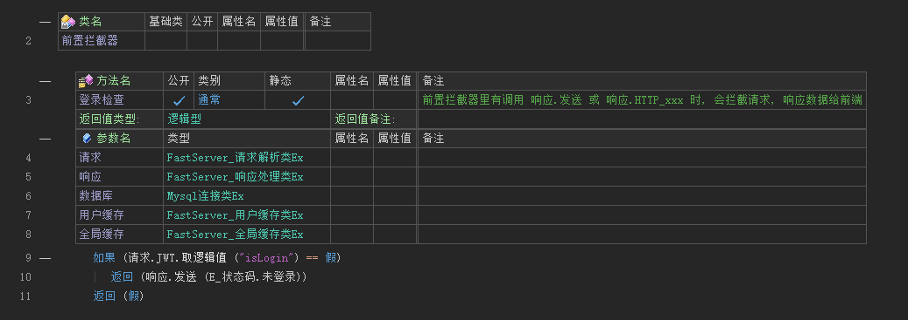

# 拦截器

拦截器分为 `前置拦截器` 和 `后置拦截器`，允许你在不修改原有业务逻辑代码的情况下，增加额外的功能，如日志记录、性能监控、事务处理、安全检查等

---

## 1. 相关函数

| 方法名                             |
| ---------------------------------- |
| FS_注册前置拦截器                  |
| FS_注册后置拦截器                  |
| FS_置默认前置拦截器                |
| FS_置默认后置拦截器                |
| FS_注册API接口(...).绑定前置拦截器 |
| FS_注册API接口(...).绑定后置拦截器 |

## 2. 前置拦截器

以登录验证为例

- 注册前置拦截器

  

- 实现前置拦截器

  如果拦截器中 主动响应 数据给用户，那么本次请求被拦截，不会触发API处理函数

  

- 设置默认前置拦截器

  在执行该命令后，注册API接口时，默认会添加目标前置拦截器。如果接口绑定了其他的前置拦截器，执行顺序是 `默认 > 绑定`。该方法可以重复调用，设置为空文本可以清空

  

  合理控制设置默认拦截器的时机，比如API接口分需要登录访问，和不需要登录访问两种，在下面例子中，在设置默认拦截器前的API接口不需要登录即可调用，后面的API接口需要通过拦截器验证

  

- 绑定前置拦截器

  在拦截器比较多，又比较复杂的情况下，推荐先将共有的拦截器设置为默认，然后手动绑定各个API接口的不同拦截器

  

  

## 3. 后置拦截器

用法和 `前置拦截器` 一致，只不过后置可以修改 原本要发送的数据，或者添加统一的响应头等。修改响应数据的方法和API处理函数一致
