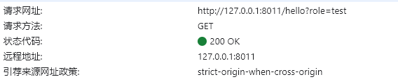

# API接口权限

用于实现不同用户，可以访问的API接口不同。

## 1. 绑定用户权限

假设现在 `hello` 接口只允许账号类型为 `test` 的用户访问，如果没有该权限的用户访问，会返回404

## 2. 设定用户权限

利用 前置拦截器，设置用户角色，这里直接以请求参数 role 的数据作为用户角色

## 3. 运行效果

- **无角色**请求 `/hello` 接口

  

- **无权限角色**访问接口

  

- **正确权限角色**访问接口

  

