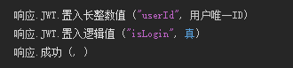
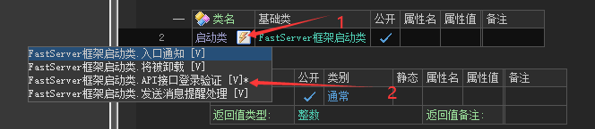
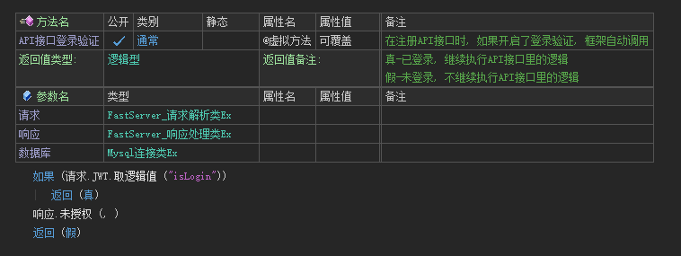
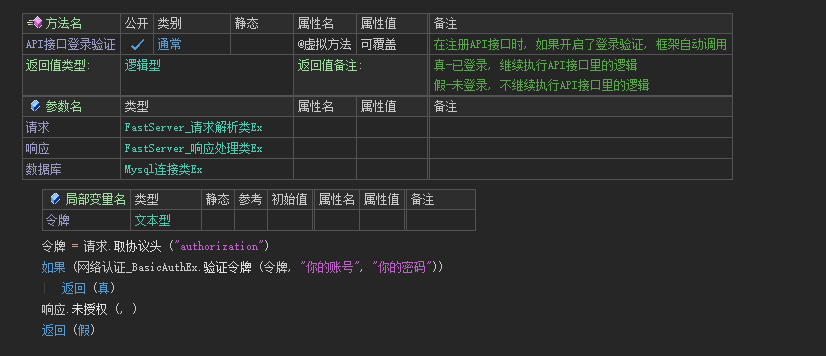

!> 新版本已废弃，更多新的使用方法请见  [拦截器](tutorial/basic/拦截器.md) ！！！

# 身份验证

## 1. 开启接口的登录验证

`注册API接口`的第三个参数设置为`真`，即可开启身份验证

如果设置为 `假`，代表不需要登录就可以访问

---

## 2. 标记用户登录

用户调用登录接口，且账号密码正确，可以通过JWT标记用户已登录

---

## 3. 验证是否登录

只有 `API接口登录验证` 返回真时才可以调用

### 3.1 添加验证接口

- **方式一：**模版创建默认会有 `API接口登录验证` 函数

- **方式二：**点击启动类边上的按钮，点击 `API接口登录验证` 进行添加

  

### 3.1 校验JWT

通过账号密码登录的服务器，会通过JWT返回登录状态，前端在将JWT发送给服务器，以告诉服务器我已经登陆过了。

### 3.2 BasicAuth验证

如果前端是EXE并也是用了FastServer模块，可以使用 `网络认证_BasicAuth.生成令牌` 来生成令牌

!> 若需要其他验证方式，可以提交实现代码给群主