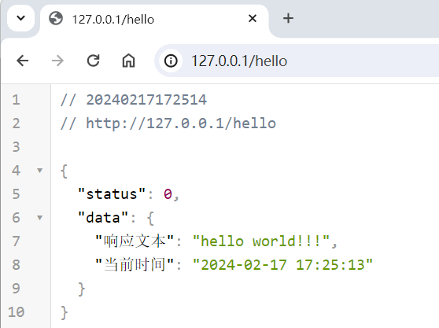

# 实现一个接口

目标：添加一个名为 `hello` 的接口，响应 `hello world!!!` 和 `当前时间`


## 1. 实现处理函数

- 在 **API** 目录下创建一个名为 `用户` 的脚本

  > 创建脚本时注意选择 **火山文本程序**

- 设置包名 `火山.程序`，类名 `API_用户`，并设置为公开

  

- 从 **APIDemo.wsv** 中复制处理函数到 **用户.wsv** 中，修改方法名为 `hello`

- 设置响应内容

  ```
  响应.数据.置入文本值 ("响应文本", "hello world!!!")
  响应.数据.置入文本值 ("当前时间", 时间_取当前日期时间Ex ())
  ```

- 最终代码如下

  


## 2. 注册接口

- 打开 `main.wsv` 

- 注册接口

  ```
  FS_注册API接口 (E_请求类型.GET, "/hello", API_用户.hello)
  ```

- 最终代码如下

  

  >  如果想要注册一个POST类型的接口，可以将  `E_请求类型.POST` 修改为 `E_请求类型.POST`

  !> 如果想要注册一个同时支持GET和POST的接口，只需要注册两个类型不同的接口即可。比如</br> `FS_注册API接口 (E_请求类型.GET, "/hello", API_用户.hello)`</br>`FS_注册API接口 (E_请求类型.POST, "/hello", API_用户.hello)`


## 3. 测试接口

- 调试运行后访问 [hello](http://127.0.0.1/hello) 接口

  > 因为浏览器插件自动格式化了响应结果，看起来的样子会稍有不同

  

