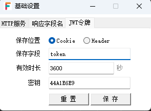

# 缓存

## 1. 缓存方案

开发过程推荐使用高性能键值表（省事）

## 2. 缓存类型

- **全局缓存**：所有接口、不同dll中数据通用
- **用户缓存**：只针对当前连接

!> 用户缓存基于JWT实现，如果用户缓存取不到值，请检查前端请求时是否携带了jwt信息

## 3. JWT保存方式

- 未启动服务的情况下点击设置

  

- 选择JWT令牌标签页

  

- 根据情况修改JWT配置

## 4. 取缓存

用户缓存和全局缓存使用方法一致

## 3. 设置缓存

用户缓存和全局缓存使用方法一致

