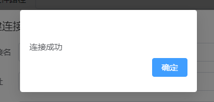
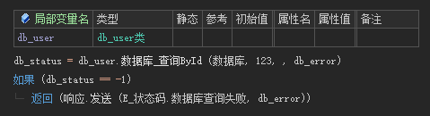

# 数据库

!> 框架目前只支持Mysql，推荐使用5.7版本

## 1. 原生用法

- 拼写sql语句

  

- 动态参数（推荐）

  > 可以防止SQL注入

  

- 调用 `执行SQL语句` 后可调用的命令

  

---

## 2. 数据库映射（推荐）

将数据库中每个表 生成 对应的一个类，数据更直观，操作更方便

### 2.1 生成数据库映射

- 打开 **开发工具**， 选择数据库切页

  

  

- 右键——新建连接

  

- 输入数据库连接信息

  

- 点击测试连接

  

- 双击数据库连接

  

- 设置映射文件生成路径

  

- 选择项目目录中，数据库——数据库映射结构这个文件

  

- 点击生成映射

- 打开项目中的 `数据库映射结构` 即可看到生成的映射代码（如果已经打开过，关闭后重新打开）

!> 修改数据库结构、添加表都需要重新生成代码

### 2.2 插入单条

### 2.3 插入多条

### 2.4 查询单条数据

- 根据主键查询

  

- 根据其他字段查询

  

- 查询指定的字段

  

### 2.5 查询多条数据

查询账号状态正常的管理员账号

- 查询所有

  

- 分页查询

  

### 2.6 修改单条数据

- 先查后改

  

- 不查询，直接修改

  

### 2.7 修改多条数据

> 映射暂未支持该方法，这里为原生写法

### 2.8 删除数据

- 根据主键删除

  

- 根据字段删除

  

- 根据条件筛选删除

  

!> **什么时候用动态参数？** 1. sql语句比较复杂，参数较多 2. sql查询参数是由前端发送的 补充：其他情况下可以不使用动态参数
