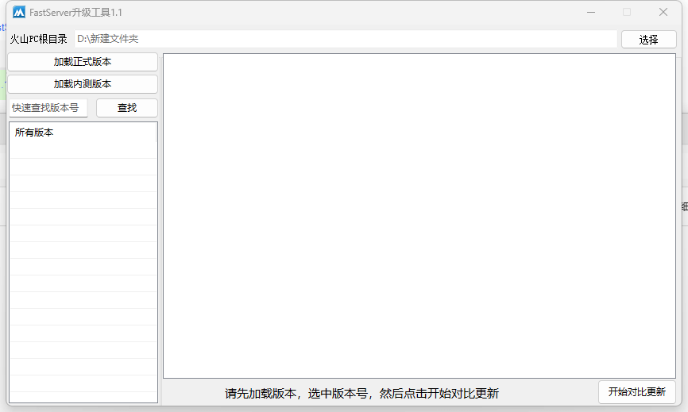
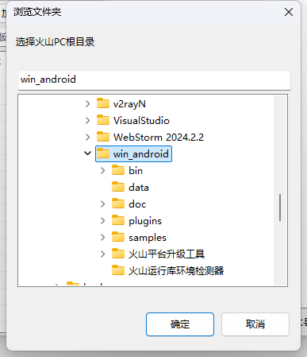
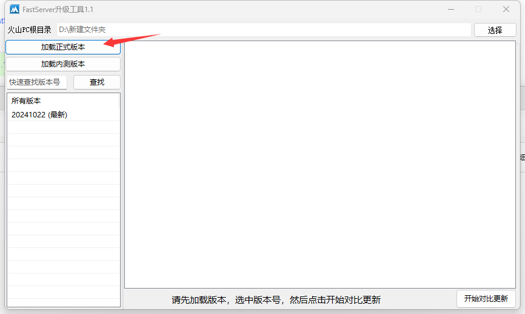
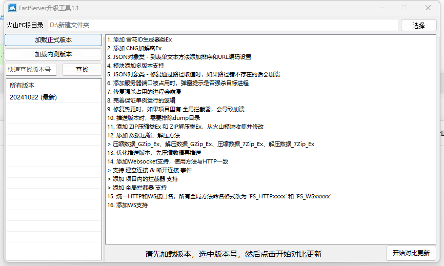
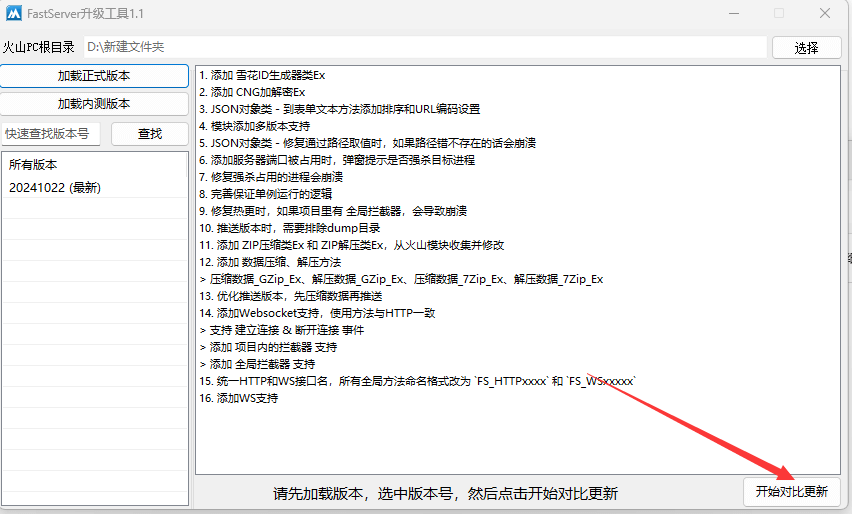

# 安装框架

## 1. 修复环境

下载 <a href="https://wway.lanzoub.com/isvZu1bgldve" download target="_blank">微软常用运行库合集</a> 并管理员运行

!> 字面意思，用于修复windows环境。不同版本的系统，会精简掉一些系统dll，导致运行运行服务器时报错 **0xE06D7363**

## 2. 安装框架

1. 下载最新的 <a href="https://wway.lanzoub.com/b01fkthng" download target="_blank">开发工具</a>

2. 解压后**运行exe**

   

3. 点击选择按钮，选择火山PC的安装的根目录（目录名可能是别的）

   

   > 如果提示："请重新选择火山PC目录"，必然是目录选择错误。程序会检测所选目录下是否包含  `\plugins\vprj_win` 两个目录

4. 点击加载正式版本

   

5. 点击要下载的版本，稍等两秒后右侧会出现更新内容

   

6. 点击对比更新

   

7. 更新结束后重新打开火山PC

