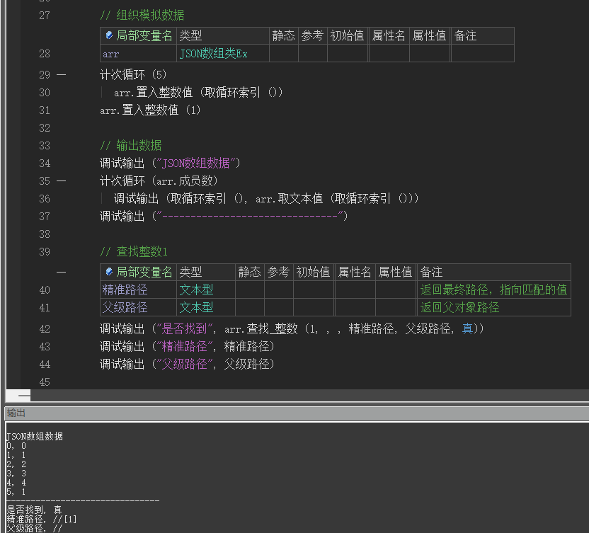
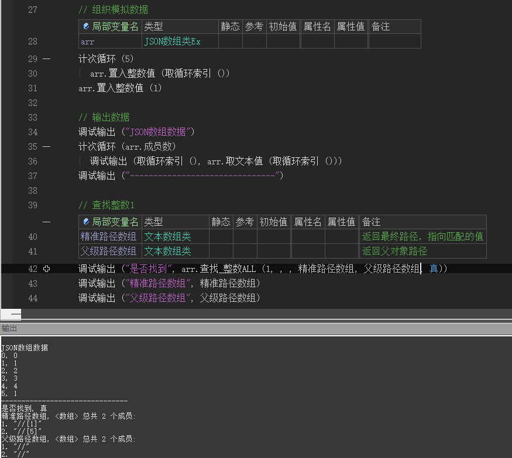

# JSON数组类Ex

## 1. 添加值

!> 火山下标从 **0** 开始

| 数据类型 | 方法              |
| -------- | ----------------- |
| 文本     | 置入文本值 (值)   |
| 小数     | 置入小数值 (值)   |
| 整数     | 置入整数值 (值)   |
| 长整数   | 置入长整数值 (值) |
| 变整数   | 置入变整数值 (值) |
| 逻辑值   | 置入逻辑值 (值)   |
| JSON对象 | 置入对象值 (值)   |
| JSON数组 | 置入数组值 (值)   |

## 2. 根据下标取值

| 数据类型 | 方法              |
| -------- | ----------------- |
| 文本     | 取文本值 (下标)   |
| 小数     | 取小数值 (下标)   |
| 整数     | 取整数值 (下标)   |
| 长整数   | 取长整数值 (下标) |
| 变整数   | 取变整数值 (下标) |
| 逻辑值   | 取逻辑值 (下标)   |
| JSON对象 | 取对象值 (下标)   |
| JSON数组 | 取数组值 (下标)   |

## 3. 根据路径取值

- 方法

  | 数据类型 | 方法                  |
  | -------- | --------------------- |
  | 文本     | 取路径文本值 (路径)   |
  | 小数     | 取路径小数值 (路径)   |
  | 整数     | 取路径整数值 (路径)   |
  | 长整数   | 取路径长整数值 (路径) |
  | 变整数   | 取路径变整数值 (路径) |
  | 逻辑值   | 取路径逻辑值 (路径)   |
  | JSON对象 | 取路径对象值 (路径)   |
  | JSON数组 | 取路径数组值 (路径)   |

- 路径举例

  | 例子                                                         | 路径               |
  | ------------------------------------------------------------ | ------------------ |
  | 取 **下标为2** 的值                                          | //[2]              |
  | 取 **下标为2** 的 **对象中name** 字段                        | //[2].name         |
  | 取 **下标为2** 的 **对象中tags** 数组 中的 **第1个** 元素    | //[2].tags[0]      |
  | 取 **下标为3** 的 **数组中** 的 **第1个** 元素               | //\[3\][0]         |
  | 取 **下标为3** 的 **数组中** 的 **第2个** **元素中的name** 字段 | //\[3\][1].name    |
  | 取 **下标为3** 的 **数组中** 的 **第2个** 元素中**tags数组** 的第5个元素的只 | //\[3\][1].tags[4] |

## 4. 查找一个值

- 方法

  | 数据类型 | 方法        |
  | -------- | ----------- |
  | 文本     | 查找_文本   |
  | 小数     | 查找_小数   |
  | 整数     | 查找_整数   |
  | 逻辑值   | 查找_逻辑值 |

- 例子

  

## 5. 查找多个值

- 方法

  | 数据类型 | 方法           |
  | -------- | -------------- |
  | 文本     | 查找_文本ALL   |
  | 小数     | 查找_小数ALL   |
  | 整数     | 查找_整数ALL   |
  | 逻辑值   | 查找_逻辑值ALL |

- 例子

  

