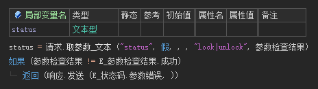
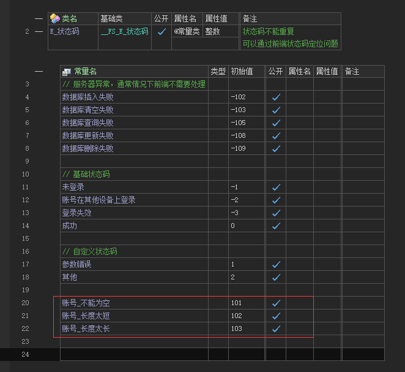
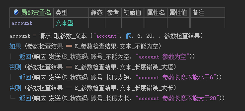

# 提交参数 - 检查


## 1. 不响应具体错误原因

需求：提交参数**status**的值只允许为 `lock` 或 `unlock`




## 2. 需要响应具体错误原因

需求：提交参数 **account** 的值不能为空，长度大于5小于21

- 定义错误码

  在 **状态码.wsv** 中定义可能出现的错误，**注意不同状态码对应的值不能重复**

  

- 取值并检查错误

  


---

## 3. 取请求协议头

```
请求.取协议头 ("Content-Type")
```

---

## 4. 取请求Cookie

```
请求.取Cookie ("jwt")
```

