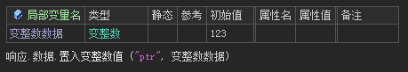
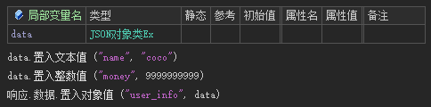
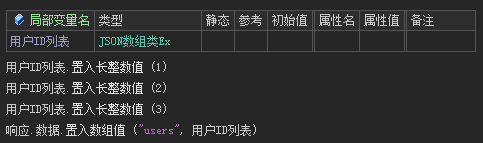
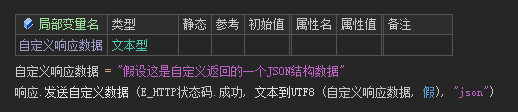
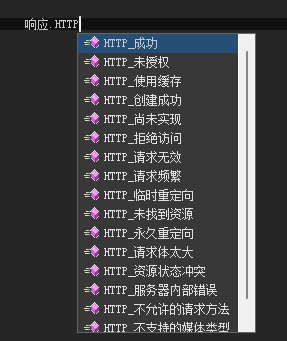
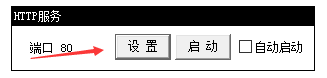
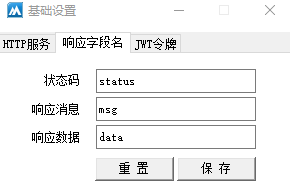

# 响应数据


## 1. 响应结构

本框架全局统一响应数据结构

```
{
	'status': 0,
	'msg': 'success',
	'data': {...}
}
```

| 结构   | 字段   | 描述                                               |
| ------ | ------ | -------------------------------------------------- |
| 状态码 | status | 正常返回0，其他情况为API接口处理异常               |
| 描述   | msg    | 针对status的描述。在没有设置状态描述时，没有该字段 |
| 数据   | data   | 响应给前端的数据。在没有设置响应数据时，没有该字段 |


## 2. 响应数据结构

调用 `响应.数据.置入xxx()`，对应响应结构中的data

| 响应数据类型 | 调用方法                                                     |
| ------------ | ------------------------------------------------------------ |
| 文本         | 响应.数据.置入文本值 ("name", "coco")                        |
| 小数         | 响应.数据.置入小数值 ("float", 3.14)                         |
| 整数         | 响应.数据.置入整数值 ("age", 18)                             |
| 长整数       | 响应.数据.置入长整数值 ("long", 9999999999)                  |
| 逻辑型       | 响应.数据.置入逻辑值 ("bool", 真)                            |
| 变整数       |  |
| JSON对象     |  |
| JSON数组     |  |


## 3. 自定义响应数据

不返回 `响应.数据` 里的内容，自定义响应给前端的数据

- 完全自定义

  > 该方法需要根据不同的状态码，做不同的数据处理

  

- 响应不同HTTP状态（推荐）

  > 基于 `响应.发送自定义数据` 实现，对于不同的状态码有不同的处理，相比上面更加简单

  


## 4. 自定义响应字段名

- 运行服务器

- 在没有启动服务的情况下，点击设置按钮

  

- 选择响应字段名标签页，修改设置后保存即可

  

  