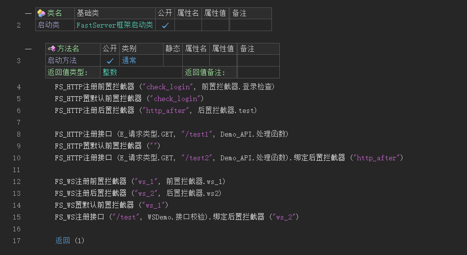
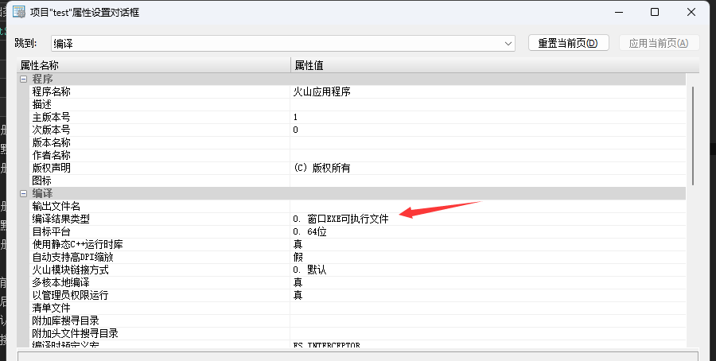
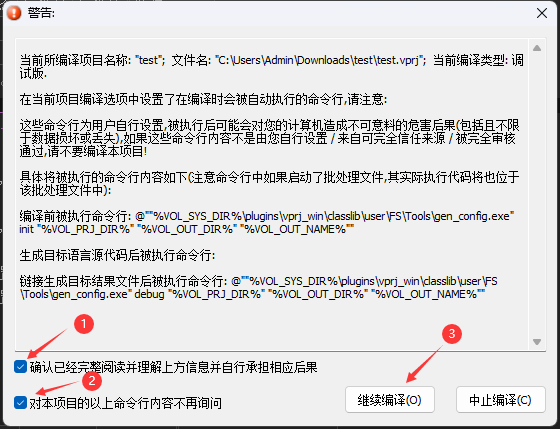
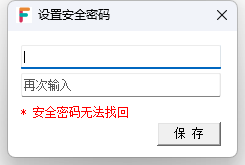
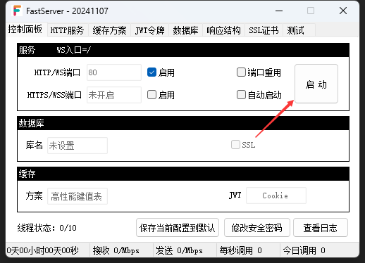

# 运行服务器

## 1. 代码预览

> 可能会因为版本更新导致模板代码不同

!> 在没有注册接口，也没注册计划任务的时候，服务器无法运行

## 2. 修改项目属性

`ALT + F7` 打开项目属性，确保编译结果类型为 `窗口EXE可执行文件`

!> 注意只支持64位

## 3. 调试运行

1. 勾选确认和不在询问

   > 在项目编译结束后，框架会利用命令行生成项目配置

   

2. 点击继续编译

3. 设置安全密码，可空。

   

4. 启动服务

   

5. 浏览器访问 [/user/login](http://127.0.0.1/user/login) 接口

   > 返回状态码为0，代表没有问题

   