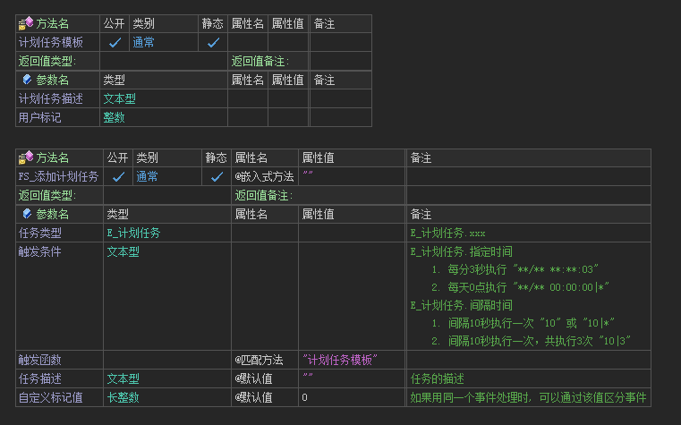

# 计划任务

## 1. 介绍

计划任务的作用有两个：

- **替代线程：**防止业务逻辑中对线程的错误使用，导致异常崩溃、无法热更、关闭服务器有线程残留的问题
- **明确功能：**计划任务主要可以分为两类：1. 指定时间运行；2. 间隔一段时间运行

推荐在`启动方法`中使用`添加计划任务`添加，下面是该方法的定义：

---

## 2. 指定时间运行

参数类型为 `E_计划任务.指定时间`

| 需求                | 触发次数 | 触发条件                   |
| ------------------- | :------: | :------------------------- |
| 11月1号零点执行     |    1     | 11/01 00:00:00\|1          |
| 每月1号零点执行     |   无限   | \*\*/01 00:00:00\|\*       |
| 每天零点执行        |   无限   | \*\*/\*\* 00:00:00\|\*     |
| 每天早上7点30分执行 |   无限   | \*\*/\*\* 07:30:00         |
| 每分钟的第1秒执行   |    10    | \*\*/\*\* \*\*:\*\*:30\|10 |

> 在不限制执行次数的时候，`|*` 可以省略

---

## 3. 间隔时间运行

参数类型为 `E_计划任务.间隔时间s` 、`E_计划任务.间隔时间ms`

| 需求                | 触发次数 | 任务类型              | 触发条件 |
| ------------------- | -------- | --------------------- | -------- |
| **10秒**后执行      | 1        | E_计划任务.间隔时间s  | 10\|1    |
| 间隔**1分钟**执行   | 无限     | E_计划任务.间隔时间s  | 60\|\*   |
| 间隔**100毫秒**执行 | 无限     | E_计划任务.间隔时间ms | 100\|1   |
| **1234毫秒**执行    | 3        | E_计划任务.间隔时间ms | 1234\|3  |