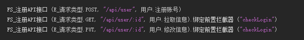

## 2024/06/17

- 框架

  - 新增

    1. 添加 BasicAuth 解析方法

       > 网络认证_BasicAuthEx.解析令牌(令牌， 返回账号， 返回密码)

    2. 添加自定义 全局缓存 & 用户缓存 

       > 见项目模板。旧版本复制项目模板中的缓存文件夹到老项目，然后添加本地现有文件即可

    3. 前置拦截器 添加自定义数据，解决拦截器里自定义数据很麻烦的问题

       ```
       // 前置拦截器，添加一个自定义值
       请求.自定义数据.置入长整数值 ("project_id", 123)
       
       // API处理函数，取自定义值
       请求.取参数_长整数 ("project_id")
       ```
  
    5. 添加 FS_取卸载DLL中
  
       > 在DLL模式下, 必须通过调用 FS_取卸载dll中() 来及时打断定时任务
  
       > 假设定时任务一直死循环运行, 当前dll则无法卸载

    6. 数据库添加事务相关

       > 开始事务、提交事务、回滚事务、结束事务

    7. 添加时区相关命令

       >  `时间_到指定时区时间戳Ex`、`时间戳_到指定时区时间Ex`、 `时间_取现行时间` （指定时区

    8. 允许服务只支持HTTPS，不接受HTTP请求

    9. 添加端口重用开关

    10. 添加服务器运行状态显示

    11. 添加定义HEAD接口支持

    12. 框架日志完善用户断开连接的原因

  - 调整

    1. 前置拦截器 接口模板添加返回值

       > 逻辑值暂无实际作用，目的明确语义。因拦截必须调用 响应.xxx，可以和返回写在一行，可以一眼看出是哪里打断了
  
    2. FS_取端口 变更为：FS\_取HTTP端口、FS\_取HTTPS端口
  
  - 修复 
  
    1. 修复数据库没有主动清空查询结果，导致之前的数据还存在的问题
    2. 修复注册API接口 "/" 时，访问返回404
    3. 修复注册API接口时，如果路径末尾有空格，会导致请求时访问返回404
    4. 修复启用HTTPS后，因任何原因导致启动失败后，再点击启动按钮都无法正常启动服务

## 2024/05/12

- 框架

  - 新增

    1. 发送小文件 接口

    2. 发送大文件 接口，支持分片发送，断点续传，限速

    3.  JSON数组 —— 查找_长整数

  - 修复 

    1. JSON替换路径不存在时会崩溃

    2. 修复 热更插件

## 2024/05/05

- 框架

  - 修复

    1. 修复Base64编码 & 解码接口
    1. 修复JSON取值时，取对象或数组时，元素是普通数据类型时会报错
    1. 修复HTTP配置页面超过32个组件的问题
  - 调整

    1.  更新火山PCHPSocket版本 6.0.1

## 2024/04/27

- 框架
  
  - 修复
  
    1. 修复Redis缓存失效
  
    2. 修复Restful路由——正则表达式规则的路由， `?` 会被截断的问题
  
    3. 修复计划任务有次数限制时，可能会崩溃的问题
  
    4. 修复数据库慢查询插入会失败，并会一直尝试插入的问题
    5. 修复表单形式提交大文件时，取不到值的问题
    6. 修复主程序推送版本失败
  
  - 调整
  
    1. 调整慢查询超时从1秒改为10秒，执行超过10秒的sql语句，会被插入慢查询表中
  
  - 新增
  
    1. 添加 注册自定义子夹（见新版本的项目模板）。可以添加特定功能，测试按钮等
    2. JSON数组 新增查找 值功能。解决查找数据的时候需要一大段代码
    3. 添加HTTPS支持
  
- 开发工具
  1. 添加数据库映射结构生成支持
  2. 修复JSON工具，待解析的内容修改后，因为搜索路径不存在导致报错

## 2024/03/11

- 框架
  1. 优化 `JSON对象` 和 `JSON数组` 取文本
  
  1. 添加方法 `FS_取JWT有效时长`
  
  1. 修复 `取小数类型参数` 时，默认最小值范围错误的问题
  
  1. 修复CPU占用的问题
  
  1. 增强框架并发能力
  
  1. 内置Redis服务添加异常重启功能
  
     > 在使用内置的Redis服务时，如果redis服务意外关闭，会尝试重新启动
  
  1. 完善默认日志
  
     > 添加单个请求的唯一ID。解决通过日志查找问题时，无法区分请求的问题
  
     > 在未设置精简日志的情况下，为输出 客户端请求的数据，和响应的数据
  
  1. 日志格式改为UTF8
  
  1. 查看日志窗口 同步修改为UTF8，并添加不同类型颜色的自定义
  
  1. 修复 查看日志窗口 存下线程残留
  
  1. 修复用户缓存Redis过期时间未生效的问题
  
  1. Redis本地服务添加检查，如果Redis异常退出会重新启动
  
  1. 添加 `请求.修改提交数据` 。用于前置拦截器解密数据
  
- 火山PC插件
  
  1. JSON解析工具
  2. 右键插入API模板
  3. 更新框架
  
- 主程序
  
  1. 加载项目时，添加对子项目框架版本的检测，防止因为版本不同导致服务崩溃
  
- 开发工具（数据库表映射）
  1. 添加 `数据库_插入或更新` 接口
  

## 2024/01/29

- 框架

  1. 日志系统添加回调事件相关命令：`日志.绑定回调事件`，`日志.解绑回调事件`，`取回调事件执行中数量`

     > 解决每个想要发送提醒的地方，都要多写好几行代码的问题
  
  2. **调整 响应.xxx 内的命令，让功能更加明确**
  
  3. 添加 `FS_取服务器名` 接口
  
- 开发工具（数据库表映射）

  1. `db_表名数组类` 改为 `E_db_表名数组类`

     > E_ 开头代表一个枚举，统一命名方式

  2. 所有使用 `文本数组` 指定 字段数组的参数，都改为了 E_db_表名数组类

     > 明确字段意义，防止传入错误的值

  3. `数据库_查询By主键` 支持指定返回字段

  4. `数据库_查询By字段` 支持指定返回字段

  5. 修复 `数据库_更新_指定主键`  不支持文本类型主键

  6. `数据库_分页查询` 支持指定返回字段

## 2024/01/21

- 框架
  1. 修复 `数据库.插入多条数据`、`数据库.更新` 如果字段名有特殊含义，比如`key` 会插入失败
  
  2. 将所有以 `API_XXX` 开头的类名统一修改为 `__API_XXX` ，解决项目开发时用API_XXX定义脚本时命名冲突
  
  3. 生成时路径错误命令修复方式：
     1. 创建一个新的FS项目，然后复制命令
     2. 右键现有项目——打开所在文件夹——用文本方式打开项目文件(.vprj)——将以下内容复制或覆盖到最下方
       ```
       settings
       {
           project
           {
               dbg_cmd_line_after_link = "@\"\"%VOL_SYS_DIR%\\plugins\\vprj_win\\classlib\\user\\FastServer模块_模版\\gen_config.exe\" debug \"%VOL_PRJ_DIR%\" \"%VOL_OUT_DIR%\" \"%VOL_OUT_NAME%\"\""
               dbg_cmd_line_before_compile = "@\"\"%VOL_SYS_DIR%\\plugins\\vprj_win\\classlib\\user\\FastServer模块_模版\\gen_config.exe\" init \"%VOL_PRJ_DIR%\" \"%VOL_OUT_DIR%\" \"%VOL_OUT_NAME%\"\""
               multi_processor_compile = true
               release_cmd_line_after_link = "@\"\"%VOL_SYS_DIR%\\plugins\\vprj_win\\classlib\\user\\FastServer模块_模版\\gen_config.exe\" release \"%VOL_PRJ_DIR%\" \"%VOL_OUT_DIR%\" \"%VOL_OUT_NAME%\"\""
               release_cmd_line_before_compile = "@\"\"%VOL_SYS_DIR%\\plugins\\vprj_win\\classlib\\user\\FastServer模块_模版\\gen_config.exe\" init \"%VOL_PRJ_DIR%\" \"%VOL_OUT_DIR%\" \"%VOL_OUT_NAME%\"\""
               require_administrator = true
           }
       }
       ```
  
       
  
- 开发工具
  1. 修复映射对象插入数据时，如果主键不是自增类型，会导致插入失败
  2. 修复无法生成有特殊含义表名对应的映射对象
  3. 修复 decimal 数据类型解析错误
  4. 映射结构添加方法 `数据库_是否存在By字段`，用于判断数据是否存在
  5. 修复数据库 数组类型映射结构 表名是**关键字**时会报错
  
- 项目模版

  1. 修复 编译命令中项目路径如果包含空格会编译报错的问题

## 2024/01/08

- 框架

  1. 修复 `FS_取数据库连接` 在热更模式下失效的问题

  2. 数据库取值时，添加反转义处理

     > 比如数据库中：This is a ""test"" string，则在取出数据时，将它转换为 This is a "test" string

  3. 修复 JSON数组通过路径取值可能崩溃的问题

  4. 添加没有注册API接口，但有 FS_添加计划任务 时，可以正常运行

- 开发工具

  1. 添加 `数据库_更新_指定Id`，用于在没有查询的时候，直接更新数据

## 2023/12/25

1. [开发工具] [优化] 字段读写，不再直接操作json对象，改为需要的时候更新json对象数据
2. [开发工具] [优化] 修复存在的注入问题
3. [开发工具] [新增] `数据库_查询By主键` 、`数据库_查询By字段` 添加排序规则字段
4. [开发工具] [新增] `数据库_删除By筛选`、`数据库_删除By字段`
5. [开发工具] [修改] 数据库查询结果统一返回 `长整数`
6. [框架] 数据库动态参数，添加对JSON数组的支持

## 2023/12/17

- 框架
  1. [修复] `请求.取用户Session` 取值返回空文本
  2. [修复] Redis缓存没生效
  3. [新增] 数据库执行SQL语句添加 动态参数
  4. [新增] 数据库删除命令，筛选条件添加 动态参数
  5. [新增] 数据库更新命令，筛选条件添加 动态参数
  6. [新增] 执行SQL语句添加动态参数
  7. [新增] 请求超过并发时，最多排队并发x3的请求数(暂时)
- 开发工具
  1. 同步框架修改，更新生成代码结构

## 2023/12/14

- 框架 & 开发工具
  1. [新增] 数据库是否使用SSL的方式

## 2023/12/14

- 框架

  1. [修复] 取 form-data 类型参数时，如果文件类型参数，没有传设置 content-type 会崩溃

  2. [修复] 服务器端口设置大于60000时，提示端口不能大于65535

  3. [修复] 使用redis时，密码只能输入数字

  4. [新增] `图片_转换类型_xxx()` 

  5. [新增] `请求.取用户Session()` ，代表当前用户的令牌，它是唯一的

  6. [新增] 保存服务器默认配置按钮

     > 服务器第一次运行时，会尝试加载目录下的 `default.ini` 配置文件

     > 解决部署服务时，需要手动修改一遍配置的问题

     > 加载成功后会删除该文件，防止信息泄露

  7. [修复] 修复服务器配置中，响应数据结构保存失败

     > 重启服务器后，配置恢复为默认字段

  8. [修复] 数据库查询结果数据类型异常，整数数据返回为文本

- 开发工具

  1. [修复] 数据库注释里有 `"` 的时候，生成代码格式错误

## 2023/11/30

- **框架**
  
  1. [修复] 编译发布版本时，没有输出日志
  
  1. [添加] 新增响应接口：`取响应Status`、`取响应Msg`、`取响应自定义数据`、`取动响应HTTP状态码`
  
  1. [添加] 指定接口的用户权限
  
  1. [添加] 服务器启动、服务器停止事件
  
  1. [添加] `FS_注册API接口(...).绑定接口信息()`
  
  1. [添加] API接口绑定用户权限，配合[拦截器](tutorial/basic/拦截器.md)实现不同用户，可以访问的API不同
  
  1. [添加] [拦截器](tutorial/basic/拦截器.md)
  
     > `FS_注册前置拦截器`、`FS_注册后置拦截器`、`FS_置默认前置拦截器`、`FS_置默认后置拦截器`
  
     > `FS_注册API接口(...).绑定前置拦截器 ("a1|a2").绑定后置拦截器 ("b1|b2")`
  
  1. [移除] 检查是否登录事件 `API接口登录验证`
  
- **主程序**
  
  1. [修复] 如果项目是中文名，生成DLL时，主项目加载该DLL失败

### **已有项目更新参考**

#### 1. 更新项目配置

右键项目属性，设置编译时命令行，使用热更功能时必须设置，新项目会默认配置

| 编译时命令行                   |                                                              |
| ------------------------------ | ------------------------------------------------------------ |
| 编译发布前命令行               | @"%VOL_SYS_DIR%\plugins\vprj_win\classlib\user\FastServer模块_模版\gen_config.exe init %VOL_PRJ_DIR% %VOL_OUT_DIR% %VOL_OUT_NAME%" |
| 链接生成发布版本文件后命令行   | @"%VOL_SYS_DIR%\plugins\vprj_win\classlib\user\FastServer模块_模版\gen_config.exe release %VOL_PRJ_DIR% %VOL_OUT_DIR% %VOL_OUT_NAME%" |
| 编译调试版前命令行             | @"%VOL_SYS_DIR%\plugins\vprj_win\classlib\user\FastServer模块_模版\gen_config.exe init %VOL_PRJ_DIR% %VOL_OUT_DIR% %VOL_OUT_NAME%" |
| 链接生成调试版结果文件后命令行 | @"%VOL_SYS_DIR%\plugins\vprj_win\classlib\user\FastServer模块_模版\gen_config.exe debug %VOL_PRJ_DIR% %VOL_OUT_DIR% %VOL_OUT_NAME%" |

#### 2. API接口登录验证

- 注册一个验证登录的前置拦截器

  


- 实现 `前置拦截器_检查登录`

  > 里面写检查逻辑，如果

  


- 设置拦截器

  > 方式1：设置默认前置拦截器，不需要登录就可访问的API接口在这之前注册

  

  > 方式2：每个接口单独设置

  


## 2023/11/10

- **框架**
  1. [修复] 同一个 API 处理方法中，连续调用两次 `网页访问Ex_T` 时，第二次会请求失败

## 2023/11/07

- **框架**
  1. [新增] 添加框架日志
  2. [新增] 添加编译后命令。用于生成配置文件，优化加载子项目逻辑
  3. [新增] 添加 `FS_取端口号 ` 接口， 接口改名统一代码规范
     - `注册API接口` => `FS_注册API接口`
     - `添加计划任务` => `FS_添加计划任务`
  4. [新增] 添加全局函数
     - `FS_取数据库连接`：在非 API 接口中取数据库连接，比如计划任务
     - `FS_是否正在运行中`：判断当前服务器是否已启动
     - `FS_取端口号`：获取当前服务使用的端口
  5. [修复] `Base64编码Ex` 和 `Base64解码Ex` 导致内存泄露
  6. [修复] 静默连接设置未生效
  7. [修复] `JSON对象Ex`和`JSON数组Ex`，取对象、取数组 类似操作的时会崩溃
  8. [修复] `网页访问Ex` 在并发的情况下，可能出现无法发送的请求
  9. [修复] 请求包体大于限制时，响应的`status字段名`错误
  10. [优化] 发送钉钉提醒不再阻塞
- **主程序**
  1. [新增] 框架默认包含一个 /ping 请求，响应内容为`pong`，可用于判断服务器是否正常运行
  2. [修复] 远程服务器列表只能添加一个
  3. [修复] 启动服务时，如果服务器端口被占用，修改端口后需要重新运行服务器才行
  4. [优化] 优化收集子项目逻辑
  5. [优化] 优化自动逻辑，现在可以在 1 秒内判断子项目已经生成结束
- **运维工具**
  1. [优化] 因为发送钉钉提醒，导致重启服务拖延了部分时间的问题

## 2023/10/12

- 开发工具
  1. 移除了对火山 PC 安卓平台目录的判断

## 2023/10/11

- **框架**

  1. **[优化] 基于 HPSocket 整体重构**

  2. [新增] Redis 缓存

  3. [新增] Mysql 参数化**防注入**

  4. [新增] 网络认证\_BasicAuthEx 全局类（生成令牌、验证令牌）
  5. [优化] 前端没有传递 content-type 时，默认以 json 的方式解析
  6. [新增] 添加**RESTful**支持
  7. [新增] 添加 `时间_取零点时间Ex`
  8. [新增] `响应` 添加不同错误的方法

- **主程序**

  1. 添加开发和发布两种运行模式
  2. 添加远程服务器管理
  3. 添加推送版本

- 开发工具
  1. 移除 QQ 群验证
