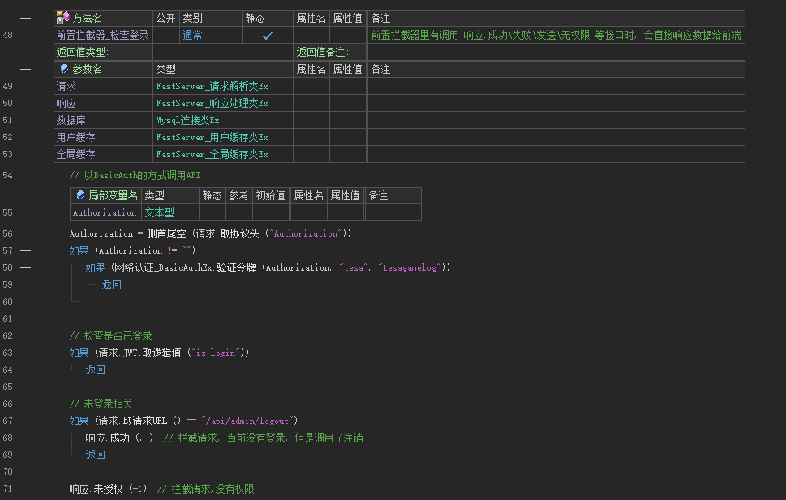
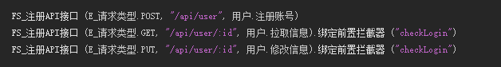

## 2023/12/25

1. [开发工具] [优化] 字段读写，不再直接操作json对象，改为需要的时候更新json对象数据
2. [开发工具] [优化] 修复存在的注入问题
3. [开发工具] [新增] `数据库_查询By主键` 、`数据库_查询By字段` 添加排序规则字段
4. [开发工具] [新增] `数据库_删除By筛选`、`数据库_删除By字段`
5. [开发工具] [修改] 数据库查询结果统一返回 `长整数`
6. [框架] 数据库动态参数，添加对JSON数组的支持

## 2023/12/17

- 框架
  1. [修复] `请求.取用户Session` 取值返回空文本
  2. [修复] Redis缓存没生效
  3. [新增] 数据库执行SQL语句添加 动态参数
  4. [新增] 数据库删除命令，筛选条件添加 动态参数
  5. [新增] 数据库更新命令，筛选条件添加 动态参数
  6. [新增] 执行SQL语句添加动态参数
  7. [新增] 请求超过并发时，最多排队并发x3的请求数(暂时)
- 开发工具
  1. 同步框架修改，更新生成代码结构

## 2023/12/14

- 框架 & 开发工具
  1. [新增] 数据库是否使用SSL的方式

## 2023/12/14

- 框架

  1. [修复] 取 form-data 类型参数时，如果文件类型参数，没有传设置 content-type 会崩溃

  2. [修复] 服务器端口设置大于60000时，提示端口不能大于65535

  3. [修复] 使用redis时，密码只能输入数字

  4. [新增] `图片_转换类型_xxx()` 

  5. [新增] `请求.取用户Session()` ，代表当前用户的令牌，它是唯一的

  6. [新增] 保存服务器默认配置按钮

     > 服务器第一次运行时，会尝试加载目录下的 `default.ini` 配置文件

     > 解决部署服务时，需要手动修改一遍配置的问题

     > 加载成功后会删除该文件，防止信息泄露

  7. [修复] 修复服务器配置中，响应数据结构保存失败

     > 重启服务器后，配置恢复为默认字段

  8. [修复] 数据库查询结果数据类型异常，整数数据返回为文本

- 开发工具

  1. [修复] 数据库注释里有 `"` 的时候，生成代码格式错误

## 2023/11/30

- **框架**
  
  1. [修复] 编译发布版本时，没有输出日志
  
  1. [添加] 新增响应接口：`取响应Status`、`取响应Msg`、`取响应自定义数据`、`取动响应HTTP状态码`
  
  1. [添加] 指定接口的用户权限
  
  1. [添加] 服务器启动、服务器停止事件
  
  1. [添加] `FS_注册API接口(...).绑定接口信息()`
  
  1. [添加] API接口绑定用户权限，配合[拦截器](FS文档/拦截器.md)实现不同用户，可以访问的API不同
  
  1. [添加] [拦截器](FS文档/拦截器.md)
  
     > `FS_注册前置拦截器`、`FS_注册后置拦截器`、`FS_置默认前置拦截器`、`FS_置默认后置拦截器`
  
     > `FS_注册API接口(...).绑定前置拦截器 ("a1|a2").绑定后置拦截器 ("b1|b2")`
  
  1. [移除] 检查是否登录事件 `API接口登录验证`
  
- **主程序**
  
  1. [修复] 如果项目是中文名，生成DLL时，主项目加载该DLL失败

### **已有项目更新参考**

#### 1. 更新项目配置

右键项目属性，设置编译时命令行，使用热更功能时必须设置，新项目会默认配置

| 编译时命令行                   |                                                              |
| ------------------------------ | ------------------------------------------------------------ |
| 编译发布前命令行               | @"%VOL_SYS_DIR%\plugins\vprj_win\classlib\user\FastServer模块_模版\gen_config.exe init %VOL_PRJ_DIR% %VOL_OUT_DIR% %VOL_OUT_NAME%" |
| 链接生成发布版本文件后命令行   | @"%VOL_SYS_DIR%\plugins\vprj_win\classlib\user\FastServer模块_模版\gen_config.exe release %VOL_PRJ_DIR% %VOL_OUT_DIR% %VOL_OUT_NAME%" |
| 编译调试版前命令行             | @"%VOL_SYS_DIR%\plugins\vprj_win\classlib\user\FastServer模块_模版\gen_config.exe init %VOL_PRJ_DIR% %VOL_OUT_DIR% %VOL_OUT_NAME%" |
| 链接生成调试版结果文件后命令行 | @"%VOL_SYS_DIR%\plugins\vprj_win\classlib\user\FastServer模块_模版\gen_config.exe debug %VOL_PRJ_DIR% %VOL_OUT_DIR% %VOL_OUT_NAME%" |

#### 2. API接口登录验证

- 注册一个验证登录的前置拦截器

  

- 实现 `前置拦截器_检查登录`

  > 里面写检查逻辑，如果

  

- 设置拦截器

  > 方式1：设置默认前置拦截器，不需要登录就可访问的API接口在这之前注册

  

  > 方式2：每个接口单独设置

  

## 2023/11/10

- **框架**
  1. [修复] 同一个 API 处理方法中，连续调用两次 `网页访问Ex_T` 时，第二次会请求失败

## 2023/11/07

- **框架**
  1. [新增] 添加框架日志
  2. [新增] 添加编译后命令。用于生成配置文件，优化加载子项目逻辑
  3. [新增] 添加 `FS_取端口号 ` 接口， 接口改名统一代码规范
     - `注册API接口` => `FS_注册API接口`
     - `添加计划任务` => `FS_添加计划任务`
  4. [新增] 添加全局函数
     - `FS_取数据库连接`：在非 API 接口中取数据库连接，比如计划任务
     - `FS_是否正在运行中`：判断当前服务器是否已启动
     - `FS_取端口号`：获取当前服务使用的端口
  5. [修复] `Base64编码Ex` 和 `Base64解码Ex` 导致内存泄露
  6. [修复] 静默连接设置未生效
  7. [修复] `JSON对象Ex`和`JSON数组Ex`，取对象、取数组 类似操作的时会崩溃
  8. [修复] `网页访问Ex` 在并发的情况下，可能出现无法发送的请求
  9. [修复] 请求包体大于限制时，响应的`status字段名`错误
  10. [优化] 发送钉钉提醒不再阻塞
- **主程序**
  1. [新增] 框架默认包含一个 /ping 请求，响应内容为`pong`，可用于判断服务器是否正常运行
  2. [修复] 远程服务器列表只能添加一个
  3. [修复] 启动服务时，如果服务器端口被占用，修改端口后需要重新运行服务器才行
  4. [优化] 优化收集子项目逻辑
  5. [优化] 优化自动逻辑，现在可以在 1 秒内判断子项目已经生成结束
- **运维工具**
  1. [优化] 因为发送钉钉提醒，导致重启服务拖延了部分时间的问题

## 2023/10/12

- 开发工具
  1. 移除了对火山 PC 安卓平台目录的判断

## 2023/10/11

- **框架**

  1. **[优化] 基于 HPSocket 整体重构**

  2. [新增] Redis 缓存

  3. [新增] Mysql 参数化**防注入**

  4. [新增] 网络认证\_BasicAuthEx 全局类（生成令牌、验证令牌）
  5. [优化] 前端没有传递 content-type 时，默认以 json 的方式解析
  6. [新增] 添加**RESTful**支持
  7. [新增] 添加 `时间_取零点时间Ex`
  8. [新增] `响应` 添加不同错误的方法

- **主程序**

  1. 添加开发和发布两种运行模式
  2. 添加远程服务器管理
  3. 添加推送版本

- 开发工具
  1. 移除 QQ 群验证
